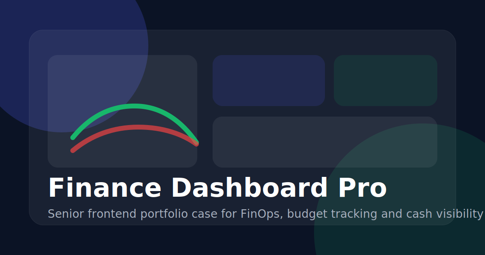

# Finance Dashboard Pro


Finance Dashboard Pro is a portfolio case built to look and feel closer to the kind of frontend work expected from a senior engineer: stronger product framing, predictable data flow, accessible interaction patterns, runtime validation, automated tests, and a CI baseline.

The app simulates a FinOps workspace for budget visibility, expense concentration, cash monitoring, and operational transaction management.



## What this project shows

- route-oriented React architecture with isolated business rules
- runtime-safe API layer with Zod
- active-period and previous-period comparison logic
- responsive dashboard and ledger flows
- keyboard-accessible modal interactions
- integration and unit tests with Vitest and Testing Library
- CI pipeline for lint, tests, and build

## Product scope

- financial dashboard with active range context
- revenue, expense, balance, and budget metrics
- comparative insights against the previous equivalent period
- transaction ledger with filters, sorting, pagination, and saved presets
- editable categories with monthly budget tracking
- CSV and PDF exports
- light and dark theme

## Stack

- React 19
- TypeScript
- Vite
- Tailwind CSS v4
- TanStack Query
- Axios
- Zod
- Framer Motion
- Recharts
- React Toastify
- json-server
- Vitest
- Testing Library

## Architecture

```text
src/
|-- components/   reusable UI and layout primitives
|-- hooks/        composition hooks and async orchestration
|-- pages/        route-level screens
|-- services/     API layer and runtime schemas
|-- types/        domain contracts
`-- utils/        pure formatting and analytics helpers
```

### Key decisions

- `TanStack Query` owns async server-state lifecycle and cache invalidation.
- `Zod` validates payloads so the UI does not trust the mock API blindly.
- The dashboard now respects the active range and compares it against the previous equivalent period instead of mixing local and global metrics.
- The ledger exposes filters in the URL to keep the state shareable and debuggable.
- The test suite targets both pure financial rules and user interactions on critical components.

## Running locally

### 1. Install dependencies

```bash
npm install
```

### 2. Configure environment

```bash
cp .env.example .env
```

### 3. Start the mock API

```bash
npm run server
```

The mock API runs at `http://localhost:3001`.

### 4. Start the app

```bash
npm run dev
```

The app runs at `http://localhost:5173`.

## Scripts

- `npm run dev` starts the frontend in development mode
- `npm run server` starts the mock API
- `npm run lint` runs ESLint
- `npm run test` starts Vitest in watch mode
- `npm run test:run` runs the automated suite with coverage
- `npm run build` runs TypeScript compilation and production bundling
- `npm run preview` previews the production build

## Quality baseline

- `lint` passing
- `build` passing
- `test:run` passing with `9/9` tests
- CI workflow for `lint`, `test:run`, and `build`
- runtime validation with Zod
- modal keyboard support and baseline accessible labels

## Portfolio highlights

### Engineering

- business logic extracted into pure utilities and tested directly
- typed service layer separated from route composition
- CI and coverage added instead of relying only on visual polish

### Product thinking

- FinOps framing instead of a generic finance template
- budget consumption and category concentration as actionable product signals
- filtered and comparative storytelling aligned with the selected time range

### UX and accessibility

- skip link, dialog semantics, focus handling, keyboard escape and focus trap
- accessible form labels and clearer interaction affordances
- responsive layouts built for both desktop and mobile

## Mock endpoints

- `GET /transactions`
- `POST /transactions`
- `PATCH /transactions/:id`
- `DELETE /transactions/:id`
- `GET /categories`
- `POST /categories`
- `PATCH /categories/:id`

## What I would add next in production

- authenticated backend and role-aware permissions
- server-driven search and pagination
- recurring transactions and audit trail
- account, workspace, and cost-center segmentation
- visual regression and end-to-end testing for routed flows
- bundle optimization focused on charting and PDF export

## Hiring-manager summary

This repository is meant to show more than component styling. The signal is in how the app is structured, how business rules are modeled, how async state is managed, how accessibility is handled, and how the project is prepared for collaboration and delivery.
